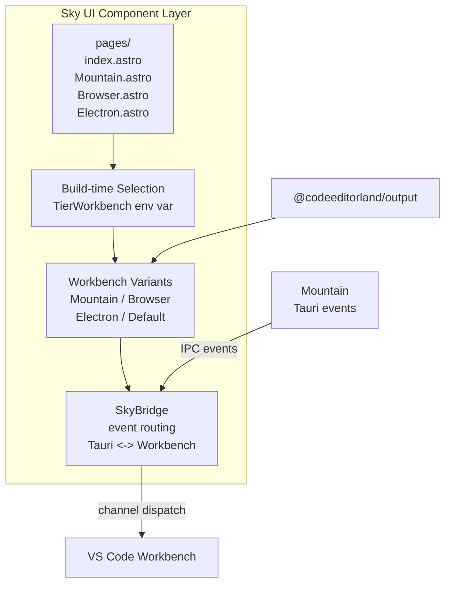

# Sky: UI Component Layer ☁️

This document describes `Sky`, the UI component layer of `Land`.

- `Sky` is built with the `Astro` framework.
- It renders the editor interface - editor, side bar, activity bar, status bar,
  and panels - inside the `Tauri` WebView.
- It loads the VS Code workbench from `@codeeditorland/output`.
- It communicates via `SkyBridge` for event routing.

---

## Table of Contents

1. [Overview](#overview)
2. [Architecture](#architecture)
3. [Page Structure](#page-structure)
4. [Workbench Variants](#workbench-variants)
5. [SkyBridge](#skybridge)
6. [Build-time Variant Selection](#build-time-variant-selection)
7. [Static Asset Layout](#static-asset-layout)
8. [Related Documentation](#related-documentation)

---



## Overview 📋

`Sky` is the rendering layer that presents the `Land` editor to the user.

- It uses `Astro` for page composition.
- It loads the VS Code workbench from `@codeeditorland/output`.
- It bridges `Tauri` events to the workbench through `SkyBridge`.

| Attribute    | Value                                                                                                                                        |
| ------------ | -------------------------------------------------------------------------------------------------------------------------------------------- |
| Language     | `TypeScript` (`Astro` v6, `Vite` v8)                                                                                                         |
| Framework    | `Astro` + `Vite`                                                                                                                             |
| IPC          | `Tauri` events (via `SkyBridge`)                                                                                                             |
| Dependencies | `@codeeditorland/wind`, `@codeeditorland/output`, `@codeeditorland/cocoon`, `@codeeditorland/worker`, `@xterm/xterm`, `astro`, `vite`, `zod` |
| Consumes     | `Wind` (services), `Output` (bundles), `Worker` (service worker)                                                                             |

---

## Architecture 🏗️

```
+------------------------------------------------------------------+
|                          Sky                                      |
|                                                                   |
|  +------------------+  +------------------+  +------------------+ |
|  | pages/           |  | Workbench/       |  | Function/        | |
|  | - index.astro    |  | - Mountain.astro |  | - SkyBridge.ts   | |
|  | - entry points   |  | - Browser.astro  |  | - Debug.ts       | |
|  |                  |  | - Electron.astro |  | - Shared.ts      | |
|  +------------------+  +------------------+  +------------------+ |
|                                                                   |
|  +------------------+  +------------------+                       |
|  | Bundled/         |  | astro.config.ts  |                       |
|  | Pre-compiled     |  | Vite/Rollup      |                       |
|  | workbench chunks |  | compilation cfg  |                       |
|  +------------------+  +------------------+                       |
+------------------------------------------------------------------+
```

### Module Map 🗺️

| Path                              | Purpose                        |
| --------------------------------- | ------------------------------ |
| `Source/pages/index.astro`        | Main entry page                |
| `Source/pages/Mountain.astro`     | Mountain workbench variant     |
| `Source/pages/Browser.astro`      | Browser workbench variant      |
| `Source/pages/Electron.astro`     | Electron workbench variant     |
| `Source/pages/Isolation.astro`    | Isolation mode variant         |
| `Source/Workbench/Mountain.astro` | Mountain workbench component   |
| `Source/Workbench/Browser.astro`  | Browser workbench component    |
| `Source/Workbench/Electron/`      | Electron workbench component   |
| `Source/Workbench/Bundled/`       | Pre-compiled workbench chunks  |
| `Source/Function/SkyBridge.ts`    | Tauri event routing bridge     |
| `Source/Function/Debug.ts`        | Debug utilities                |
| `Source/Function/Shared.ts`       | Shared UI utilities            |
| `Source/Function/Build/`          | Build-time compilation helpers |

---

## Page Structure 📄

`Sky` provides multiple page entry points, each selecting a different workbench
variant.

### index.astro

The default entry point. It selects the active workbench at build time based on
environment variables:

```astro
---
// Pseudo-code from Sky's build-time conditional import
const WorkbenchComponent =
	TierWorkbench === "Mountain"
		? MountainWorkbench
		: TierWorkbench === "Electron"
			? ElectronWorkbench
			: TierWorkbench === "Browser"
				? BrowserWorkbench
				: DefaultWorkbench;
---

<WorkbenchComponent />
```

### Pages Overview

| Page                 | Workbench | Purpose                                              |
| -------------------- | --------- | ---------------------------------------------------- |
| `index.astro`        | Dynamic   | Default entry point, delegates to workbench selector |
| `Mountain.astro`     | Mountain  | Production workbench for Tauri runtime               |
| `Browser.astro`      | Browser   | Development workbench with limited native features   |
| `Electron.astro`     | Electron  | Maximum VS Code compatibility variant                |
| `BrowserProxy.astro` | Browser   | Proxy-mode workbench                                 |
| `Isolation.astro`    | Isolation | Minimal workbench for testing                        |

---

## Workbench Variants 🖥️

`Sky` supports multiple workbench variants compiled through `Vite`/`Rollup`:

| Variant          | Astro Page           | Feature Coverage        | Build Profile             |
| ---------------- | -------------------- | ----------------------- | ------------------------- |
| **Mountain**     | `Mountain.astro`     | 80-90%                  | `debug-mountain`          |
| **Browser**      | `Browser.astro`      | 70-80%                  | `debug`                   |
| **Electron**     | `Electron.astro`     | 95%+                    | `debug-electron`          |
| **Default**      | `Default.astro`      | Base workbench          | `debug-workbench-bundled` |
| **BrowserProxy** | `BrowserProxy.astro` | 70-80%                  | `debug-browser`           |
| **NLS**          | `NLS.astro`          | Natural language search | (experimental)            |

### Variant Selection

The active variant is selected at build time and compiled by `Vite`. Unused
variants are tree-shaken and do not enter the production module graph:

```typescript
// astro.config.ts maps TierWorkbench to import path
const workbenchPath =
	{
		mountain: "./Workbench/Mountain.astro",
		browser: "./Workbench/Browser.astro",
		electron: "./Workbench/Electron.astro",
	}[TierWorkbench] || "./Workbench/Default.astro";
```

---

## SkyBridge 🌉

`SkyBridge` (`Source/Function/SkyBridge.ts`, ~2900 lines) is the runtime event
routing bridge between `Tauri`'s IPC system and the VS Code workbench's internal
message channel system.

### Event Translation Table

| Tauri Event                     | VS Code Workbench Channel  | Direction             |
| ------------------------------- | -------------------------- | --------------------- |
| `mountain:configurationChanged` | `onDidChangeConfiguration` | Mountain -> Workbench |
| `mountain:extensionsChanged`    | `onDidChangeExtensions`    | Mountain -> Workbench |
| `mountain:themeChanged`         | `onDidChangeColorTheme`    | Mountain -> Workbench |
| `mountain:fileChanged`          | FileSystem watcher events  | Mountain -> Workbench |
| `cocoon:commandExecuted`        | Extension command result   | Cocoon -> Workbench   |

### Bridge Architecture

```
Mountain emits Tauri event
    |
    v
Tauri WebView event listener
    |
    v
SkyBridge intercepts event
    |
    +---> Translates to VS Code internal channel format
    +---> Dispatches to registered workbench handlers
    +---> Handles async responses if required
    |
    v
VS Code workbench service receives notification
```

### Webview Panel Management

`SkyBridge` manages webview content injection through `first-set-html` logging:

```
Extension calls vscode.window.createWebviewPanel()
    |
    v
Cocoon sends gRPC createWebviewPanel request
    |
    v
Mountain creates Wry webview
    |
    v
SkyBridge sets HTML content:
    applied=method  -> Content reached real WebviewInput
    applied=setter  -> Content stored, view not yet parked
    applied=skipped -> No parked view available (silent drop)
```

---

## Build-time Variant Selection 🔧

`Sky` uses `Vite`'s conditional dynamic imports to select the active workbench
at build time:

```typescript
// vite.config.ts / astro.config.ts
// The TierWorkbench env var determines which variant is compiled
const activeWorkbench = process.env.TierWorkbench || "Mountain";
```

### Bundle Output

Each variant produces its own bundle:

```
Sky/Target/Static/
+-- Bundled/
    +-- Mountain/          # When TierWorkbench=Mountain
    |   +-- workbench.js
    |   +-- workbench.css
    +-- Electron/          # When TierWorkbench=Electron
    |   +-- workbench.js
    |   +-- workbench.css
    +-- Browser/           # When TierWorkbench=Browser
        +-- workbench.js
        +-- workbench.css
+-- Application/          # Static assets (non-bundled mode)
```

---

## Static Asset Layout 📁

After a successful build, `Sky`'s output is organized as:

```
Sky/Target/
+-- Static/
    +-- Bundled/
    |   +-- {Variant}/
    |       +-- workbench.js          # Compiled workbench bundle
    |       +-- workbench.css         # Compiled workbench styles
    |       +-- chunks/               # Lazy-loaded code chunks
    +-- Application/                  # Dev mode static assets
        +-- index.html                # Compiled entry page
        +-- assets/                   # CSS, JS, fonts
        +-- worker.js                 # Service worker script
```

---

## Related Documentation 📚

- [Wind](https://github.com/CodeEditorLand/Wind/tree/Current/Documentation/GitHub/Architecture.md) -
  Service layer (`Sky` consumes)
- [Cocoon](https://github.com/CodeEditorLand/Cocoon/tree/Current/Documentation/GitHub/Architecture.md) -
  Extension host (`SkyBridge` target)
- [Worker](https://github.com/CodeEditorLand/Worker/tree/Current/Documentation/GitHub/Architecture.md) -
  Service worker (`Sky` integrates)
- [Output](https://github.com/CodeEditorLand/Output/tree/Current/Documentation/GitHub/Architecture.md) -
  Compiled workbench source
- [Mountain](https://github.com/CodeEditorLand/Mountain/tree/Current/Documentation/GitHub/Architecture.md) -
  Backend (IPC source)
- [Polyfills](https://github.com/CodeEditorLand/Land/tree/Current/Documentation/GitHub/Polyfills.md) -
  `SkyBridge` and preload shim details
- [BuildPipeline](https://github.com/CodeEditorLand/Land/tree/Current/Documentation/GitHub/BuildPipeline.md) -
  Build pipeline for workbench variants

---

**Project Maintainers:** Source Open
([Source/Open@Editor.Land](mailto:Source/Open@Editor.Land)) |
[GitHub Repository](https://github.com/CodeEditorLand/Sky) |
[Report an Issue](https://github.com/CodeEditorLand/Sky/issues)
