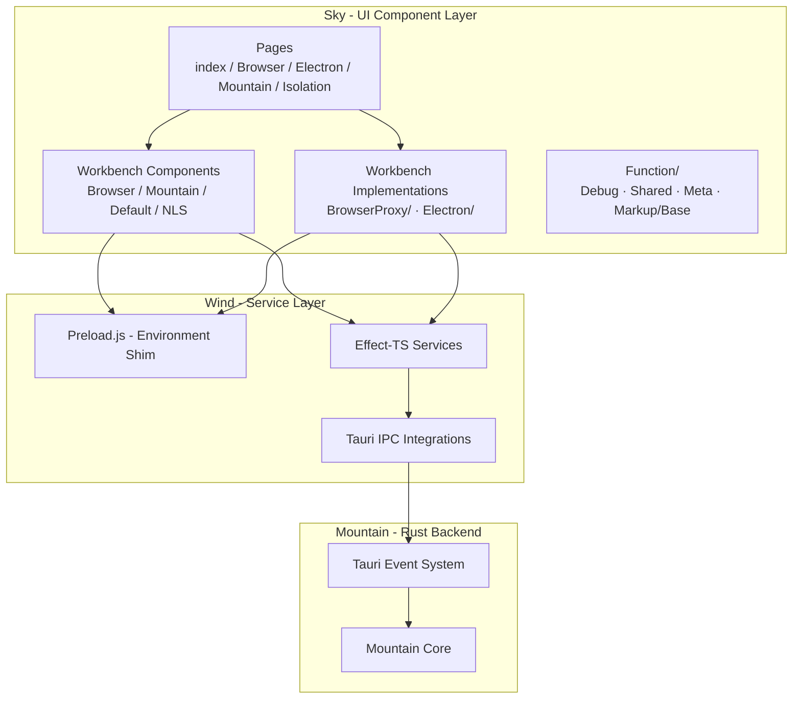
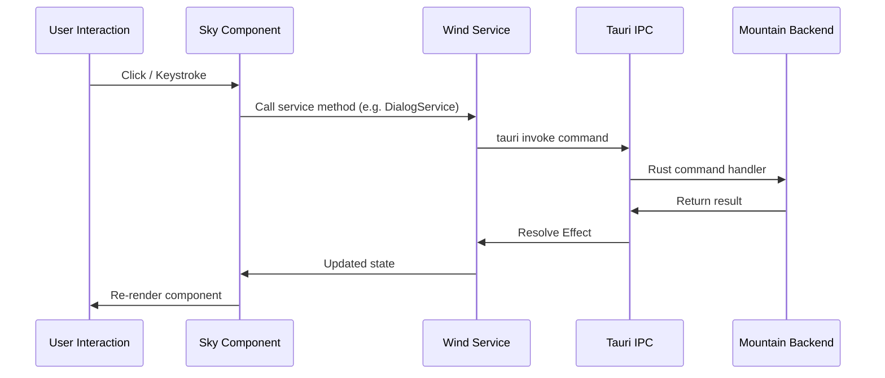

# Sky - Deep Dive

Sky provides the technical foundation UI component layer
within the Land ecosystem. **Sky** renders the complete editor interface inside
the Tauri webview using Astro, consuming state and services from the Wind
service layer.

---

## Architecture

Sky is organized into three tiers: page routes that define Tauri webview entry
points, workbench components that compose the VSCode-compatible editor layout,
and utility functions that support the build and runtime process.

---

## Key Modules

| Path                                             | Description                                                                  |
| :----------------------------------------------- | :--------------------------------------------------------------------------- |
| `Source/pages/index.astro`                       | Default entry point; reads environment variables to select workbench variant |
| `Source/pages/Mountain.astro`                    | A2 workbench page - recommended production entry point                       |
| `Source/pages/Browser.astro`                     | A1 browser-only workbench page                                               |
| `Source/pages/BrowserProxy.astro`                | A1 browser workbench with services proxy                                     |
| `Source/pages/Electron.astro`                    | A3 workbench page with Electron polyfills                                    |
| `Source/pages/Isolation.astro`                   | Isolated mode page for extension sandboxing                                  |
| `Source/Workbench/Mountain.astro`                | A2 workbench component - loads VSCode UI with Mountain providers             |
| `Source/Workbench/Browser.astro`                 | A1 workbench component - pure browser workbench                              |
| `Source/Workbench/BrowserProxy/Layout.astro`     | A1 layout with service proxy bootstrapping                                   |
| `Source/Workbench/BrowserProxy/Bootstrap.ts`     | Initializes Effect-TS runtime and services for BrowserProxy                  |
| `Source/Workbench/BrowserProxy/ServicesProxy.ts` | Service proxy implementation                                                 |
| `Source/Workbench/Electron/Layout.astro`         | A3 layout with Electron polyfill injection                                   |
| `Source/Workbench/Electron/Polyfills.ts`         | Electron compatibility shims                                                 |
| `Source/Workbench/NLS.astro`                     | Natural language support component                                           |
| `Source/Function/Debug.ts`                       | Build-time debug utilities                                                   |
| `Source/Function/Shared.ts`                      | Shared runtime utilities                                                     |
| `Source/Function/Meta.astro`                     | HTML meta tag component                                                      |
| `Source/Function/Markup/Base.astro`              | Base HTML layout skeleton                                                    |
| `astro.config.ts`                                | Astro build configuration, alias resolution, Vite settings                   |

---

## Sky Bridge

`Source/Function/Sky/Bridge.ts` subscribes to all `sky://` Tauri events emitted
by Mountain and routes them to VS Code workbench APIs or DOM manipulation. The
bridge is modular: each `Install*` module in `Bridge/` registers a related group
of channels.

> Mountain is used as a relay for Cocoon↔Sky communication. Sky emits a `sky://`
> Tauri event → Mountain re-emits as a gRPC notification to Cocoon. This avoids
> a separate transport while keeping the workbench renderer and the extension
> host decoupled.

### Bridge Modules

| Module                                | Registered channels / responsibility                                                                                                                                                                                                       |
| :------------------------------------ | :----------------------------------------------------------------------------------------------------------------------------------------------------------------------------------------------------------------------------------------- |
| `InstallCommands.ts`                  | `sky://command/execute`, `sky://command/register`, `sky://command/unregister`                                                                                                                                                              |
| `InstallDebug.ts`                     | `sky://debug/sessionStart`, `sky://debug/sessionEnd`, `sky://debug/consoleAppend`, `sky://debug/dap-message`, `sky://debug/addBreakpoints` → `IDebugService.addBreakpoints()`, `sky://debug/removeBreakpoints`, `sky://customEditor/saved` |
| `InstallDiagnostics.ts`               | Diagnostic / smoke-test channels                                                                                                                                                                                                           |
| `InstallEditorAndOutput.ts`           | `sky://workspace/applyEdit`, `sky://workspace/save*`, output channel create/append/clear/show/dispose                                                                                                                                      |
| `InstallEditorOperations.ts`          | Monaco `onDidChangeModelContent` debounced (300 ms) → `sky:model:contentChanged` → Mountain → Cocoon `onDidChangeTextDocument`; `sky://editor/apply-text-edits` handles both VS Code 0-based and Monaco 1-based ranges                     |
| `InstallFanOut.ts`                    | Multi-subscriber fan-out for high-frequency events                                                                                                                                                                                         |
| `InstallInlineCompletions.ts`         | Registers `ILanguageFeaturesService.inlineCompletionsProvider` with a wildcard selector; on trigger, calls `language:provideInlineCompletions` IPC → Mountain's `ProvideInlineCompletionItems` gRPC handler → Cocoon registered providers  |
| `InstallProgressTerminalWorkspace.ts` | `sky://progress/*`, `sky://terminal/*`, `sky://workspace/*`                                                                                                                                                                                |
| `InstallScm.ts`                       | `sky://scm/register` with 10×200 ms retry for `__CEL_SERVICES__.SCM` population race; `sky://scm/provider/changed` updates workbench input model                                                                                           |
| `InstallSearch.ts`                    | `sky://search/*` channels                                                                                                                                                                                                                  |
| `InstallSimpleRelays.ts`              | Pure DOM-event re-dispatchers for `cel:*` consumer subscriptions; `sky://language/configure` → `monaco.languages.setLanguageConfiguration()`                                                                                               |
| `InstallStatusbar.ts`                 | `sky://statusbar/update`, `sky://statusbar/dispose`, `sky://statusbar/set-message`                                                                                                                                                         |
| `InstallTasksAndDecorations.ts`       | Task and decoration channel relays                                                                                                                                                                                                         |
| `InstallTreeView.ts`                  | Tree-view `onDidChangeSelection`, `onDidCollapse`, `onDidExpand` CustomEvent forwarding; `sky://tree-view/reveal` → `IViewsService.openView()`                                                                                             |
| `InstallUiRequests.ts`                | `sky://ui/show-message-request`, QuickPick / InputBox round-trips via `IQuickInputService`                                                                                                                                                 |
| `InstallWebview.ts`                   | `sky://webview/message`, `sky://webview/dispose`                                                                                                                                                                                           |

---

## Build Optimization

### Code Splitting (S1)

For non-bundled profiles (`debug-electron`, etc.) `vs/**` is entirely external,
so Sky's own module graph would otherwise concatenate into one large chunk. The
`manualChunks` configuration in `astro.config.ts` splits it into four named
chunks the browser preloader can fetch in parallel and V8 can parse on separate
threads:

| Chunk name        | Contents                                                    |
| :---------------- | :---------------------------------------------------------- |
| `effect-rt`       | Effect-TS runtime (~800 KB, rarely changes)                 |
| `wind-effect-gen` | Wind's codegen Effect layer (large, stable, cache-friendly) |
| `sky-telemetry`   | PostHog + OTLP bridge (never on the synchronous paint path) |
| `sky-debug`       | SmokeTest / diagnostic harness (debug builds only)          |

The bundled profiles (`Pack=electron`, etc.) must not use `manualChunks` because
the workbench loader's auto-split boundary (`workbench.js` →
`workbench.desktop.main.js`) is required for correct initialization order.

### Sourcemaps

Sourcemaps are generated as `"inline"` in dev builds (`On=true`) for WKWebView
DevTools and profiler symbol resolution. Production builds disable sourcemaps to
avoid shipping artifacts that are 3× the bundle size.

---

## Data Flow

The following sequence shows how a user action travels from the Sky UI through
Wind services to the Mountain backend and back.

**Startup sequence:**

1. Tauri loads the webview pointing at Sky's built output.
2. The page route reads environment variables and selects a workbench variant.
3. Wind's `Preload.ts` shims `window.vscode` globals before VSCode code runs.
4. Wind bootstraps the Effect-TS service layer and establishes Tauri IPC.
5. Sky components subscribe to Wind services for live state updates.
6. Sky listens for Tauri events from Mountain (`sky://terminal/data`,
   `sky://scm/update-group`, `sky://configuration/changed`) to update UI.

---

## Integration Points

| Connecting Element | Direction     | Mechanism          | Description                                                                  |
| :----------------- | :------------ | :----------------- | :--------------------------------------------------------------------------- |
| **Wind**           | Inbound       | Direct import      | Sky consumes Wind Effect-TS services for all business logic                  |
| **Mountain**       | Bidirectional | Tauri IPC + Events | Commands sent via Tauri invoke; updates received as Tauri events             |
| **Output**         | Inbound       | Static bundle      | VSCode core UI components loaded from `@codeeditorland/output`               |
| **Worker**         | Inbound       | Web Worker API     | Web workers for background processing imported from `@codeeditorland/worker` |

---

## Configuration

| Variable       | Default      | Description                                                   |
| :------------- | :----------- | :------------------------------------------------------------ |
| `Mountain`     | unset        | Set to `true` to load the A2 Mountain workbench (recommended) |
| `Electron`     | unset        | Set to `true` to load the A3 Electron workbench               |
| `BrowserProxy` | unset        | Set to `true` to load the A1 BrowserProxy workbench           |
| `Browser`      | unset        | Set to `true` to load the A1 Browser workbench                |
| `NODE_ENV`     | `production` | Controls source map generation and debug output               |

When no variant flag is set, `index.astro` loads `Workbench/Default.astro`. The
recommended deployment always sets `Mountain=true`.

**Astro configuration** (`astro.config.ts`) resolves Wind and other
`@codeeditorland/*` packages through Vite aliases, sets `Source/` as the content
root, and directs build output to `Target/`.

---

**Project Maintainers:** Source Open
([Source/Open@Editor.Land](mailto:Source/Open@Editor.Land)) |
[GitHub Repository](https://github.com/CodeEditorLand/Land) |
[Report an Issue](https://github.com/CodeEditorLand/Land/issues)
