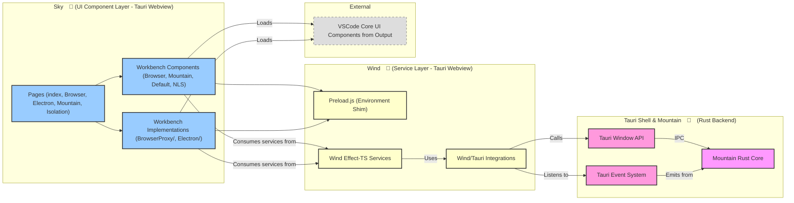

<table>
<tr>
<td align="left" valign="middle">
<h3 align="left"> Sky</h3>
</td>
<td align="left" valign="middle">
<h3 align="left">
  🌌
</h3>
</td>
<td align="left" valign="middle">
<h3 align="left"> + </h3>
</td>
<td align="left" valign="middle">
<h3 align="left">
<a href="https://Editor.Land" target="_blank">
<picture>
<source media="(prefers-color-scheme: dark)" srcset="https://PlayForm.Cloud/Dark/Image/GitHub/Land.svg">
<source media="(prefers-color-scheme: light)" srcset="https://PlayForm.Cloud/Image/GitHub/Land.svg">

</picture>
</a>
</h3>
</td>
<td align="left" valign="middle">
<h3 align="left">
<a href="https://Editor.Land" target="_blank">
Land
</a>
</h3>
</td>
<td align="left" valign="middle">
<h3 align="left">
 🏞️
</h3>
</td>
</tr>
</table>

---

# **Sky** 🌌 The UI Component Layer for Land 🏞️

[](https://github.com/CodeEditorLand/Land/tree/Current/LICENSE)
[](https://www.npmjs.com/package/@codeeditorland/sky)
[](https://www.npmjs.com/package/astro)
[](https://www.npmjs.com/package/effect)

Welcome to **Sky**, the declarative **UI component layer** of the **Land Code
Editor**. Built with the **Astro** framework, **Sky** renders the user interface
including the editor, side bar, activity bar, status bar, and panels. It
operates within the **Tauri** webview alongside `Wind`, consuming state and
services from the `Wind` service layer to display and manage the editor's visual
presentation.

**Sky** is engineered to:

1. **Render UI Components:** Provide a comprehensive set of Astro-based
   components that compose the Land editor interface.
2. **Support Multiple Workbench Variants:** Offer four distinct workbench
   approaches (A1-A4) for different deployment scenarios.
3. **Integrate with Wind Services:** Consume `Wind`'s Effect-TS powered services
   for state management and backend communication.
4. **Enable Page Routing:** Manage application navigation and page transitions
   within the Tauri webview.

---

## Key Features 🔐

- **Astro-Based Component Architecture:** Leverages Astro's component islands
  architecture for efficient, content-driven UI development with zero JavaScript
  by default and selective hydration for interactive components.
- **VSCode UI Compatibility:** Provides multiple workbench approaches that load
  and integrate VSCode's core UI components from `@codeeditorland/output`,
  ensuring high-fidelity editor experience.
- **Wind Service Layer Integration:** Seamlessly consumes `Wind`'s Effect-TS
  services for file operations, dialogs, configuration, and state management,
  enabling a clean separation between UI and business logic.
- **Tauri Webview Integration:** Runs within the Tauri webview, communicating
  with the `Mountain` backend through Tauri's IPC mechanism and event system for
  native OS capabilities.
- **Flexible Workbench Variants:** Supports multiple workbench approaches
  through environment-based selection:
    - **A1 (Browser/BrowserProxy):** Browser-based workbench with optional
      service proxy
    - **A2 (Mountain - RECOMMENDED):** Browser workbench with Mountain-backed
      providers
    - **A3 (Electron):** Electron workbench with polyfills for VSCode
- **Component Modularity:** Organized into Pages (routes), Workbenches
  (components), and Workbench Implementations (BrowserProxy/, Electron/
  subdirectories) for clear separation of concerns and maintainability.
- **Responsive Design:** Built with CSS and Astro's styling capabilities to
  ensure the editor interface adapts to different window sizes and user
  preferences.

---

## Core Architecture Principles 🏗️

| Principle           | Description                                                                                                                     | Key Components Involved                                                                     |
| :------------------ | :------------------------------------------------------------------------------------------------------------------------------ | :------------------------------------------------------------------------------------------ |
| **Compatibility**   | Provide high-fidelity VSCode UI rendering to maximize compatibility with VSCode extensions and workflows.                       | `Workbench/*`, `Workbench/BrowserProxy/*`, `Workbench/Electron/*`, `@codeeditorland/output` |
| **Modularity**      | Components (pages, workbenches, layouts) are organized into distinct, cohesive modules for clarity and maintainability.         | `pages/*`, `Workbench/*`, `Workbench/BrowserProxy/*`, `Workbench/Electron/*`, `Function/*`  |
| **Performance**     | Leverage Astro's static generation and selective hydration to minimize JavaScript payload and maximize rendering performance.   | Astro build system, Component Islands                                                       |
| **Integration**     | Seamlessly connect with `Wind` services and `Mountain` backend through Tauri events and IPC for state updates and user actions. | `Install`, `Bootstrap`, Tauri event listeners                                               |
| **Maintainability** | Clear separation between UI components and business logic, with UI state driven by `Wind` services for predictable data flow.   | Service consumption pattern, Event-driven updates                                           |

---

## Deep Dive & Component Breakdown 🔬

To understand how `Sky`'s internal components interact, including the Astro
configuration, workbench approaches, and integration with `Wind`, please refer
to the detailed technical breakdown in the `Documentation/` directory or the
source code comments in [`astro.config.ts`](astro.config.ts) and workbench
components. The source files explain the role of each workbench variant, page
routing, and the build process for bundling Wind modules.

---

## `Sky` in the Land Ecosystem 🌌 + 🏞️

| Component              | Role & Key Responsibilities                                                                                                             |
| :--------------------- | :-------------------------------------------------------------------------------------------------------------------------------------- |
| **Astro Components**   | The declarative UI building blocks that compose the editor interface, from activity bar to status bar.                                  |
| **Tauri Webview**      | The runtime environment where `Sky` executes, providing access to Tauri APIs and OS integration.                                        |
| **Wind Integration**   | Consumes `Wind`'s Effect-TS services for file operations, dialogs, configuration, and state management.                                 |
| **Workbench Variants** | Multiple approaches (A1-A3) for loading and integrating VSCode's core editor components: Browser, Mountain (recommended), and Electron. |
| **Page Routing**       | Manages navigation between index (default), Browser, BrowserProxy, Electron, Mountain, and Isolation pages.                             |
| **Event Handling**     | Listens for Tauri events from `Mountain` to update UI state (terminal output, SCM updates, etc.).                                       |

---

## Interaction Flow: Rendering UI from Wind State 🔄

Here's a step-by-step example of how `Sky` renders the UI based on `Wind`'s
state:

1. **Page Load:** User navigates to `/`, which loads `index.astro` (the default
   workbench entry point).
2. **Workbench Selection:** The page reads environment variables to determine
   which workbench to load:
    - `Mountain=true` → Loads the recommended A2: Mountain workbench
      (`Workbench/Mountain.astro`)
    - `Electron=true` → Loads A3: Electron workbench
      (`Workbench/Electron/Layout.astro`)
    - `BrowserProxy=true` → Loads A1: Browser Proxy workbench
      (`Workbench/BrowserProxy/Layout.astro`)
    - `Browser=true` → Loads A1: Browser workbench (`Workbench/Browser.astro`)
    - Default → Loads `Workbench/Default.astro`

3. **Wind Bootstrap:** The workbench imports and executes `@codeeditorland/wind`
   bootstrap, which:
    - Installs the `Preload.ts` environment shim (providing `window.vscode`
      globals)
    - Initializes Effect-TS runtime and service layers
    - Establishes Tauri IPC connection to `Mountain`

4. **Service Consumption:** `Sky` components subscribe to `Wind` services:
    - `StatusBarService` → Updates status bar items
    - `ActivityBarService` → Manages activity bar state
    - `FileSystemService` → Provides file tree data to sidebar

5. **Event Listening:** `Sky` listens for Tauri events from `Mountain`:
    - `sky://terminal/data` → Renders terminal output in panel
    - `sky://scm/update-group` → Updates source control view
    - `sky://configuration/changed` → Re-renders affected UI components

6. **User Interaction:** When user clicks "Open File":
    - `Sky` component calls `Wind`'s `DialogService.showOpenDialog()`
    - `Wind` invokes Tauri's native dialog via `@tauri-apps/plugin-dialog`
    - Selected file URI is returned through `Wind` to `Sky`
    - `Sky` updates the editor component to display the opened file

---

## System Architecture Diagram 🏗️

This diagram illustrates how `Sky` sits within the Tauri webview, consuming
`Wind` services and rendering the UI.



---

## Project Structure Overview 🗺️

The `Sky` repository is organized to separate concerns between pages,
workbenches, and components:

```
Sky/
├── Source/
│   ├── pages/ # Page routes
│   │   ├── index.astro # Home page (default workbench entry)
│   │   ├── Browser.astro # A1: Browser workbench page
│   │   ├── BrowserProxy.astro # A1: Browser + services proxy page
│   │   ├── Electron.astro # A3: Electron + polyfills page
│   │   ├── Isolation.astro # Isolated mode page
│   │   └── Mountain.astro # A2: Mountain providers page (RECOMMENDED)
│   ├── Workbench/ # Workbench component implementations
│   │   ├── Default.astro # Deprecated entry point
│   │   ├── Browser.astro # Browser workbench component
│   │   ├── BrowserTest.astro # Test workbench component
│   │   ├── Mountain.astro # A2: Mountain workbench component (RECOMMENDED)
│   │   ├── NLS.astro # Natural Language Support component
│   │   ├── BrowserProxy/ # A1: Browser Proxy implementation
│   │   │   ├── Bootstrap.ts
│   │   │   ├── Layout.astro
│   │   │   ├── ServicesProxy.ts
│   │   │   ├── WindPreload.ts
│   │   │   └── Workbench.ts
│   │   └── Electron/ # A3: Electron implementation
│   │       ├── Bootstrap.ts
│   │       ├── Layout.astro
│   │       ├── Polyfills.ts
│   │       ├── WindPreload.ts
│   │       └── Workbench.ts
│   ├── Function/ # Utility functions and base components
│   │   ├── Debug.ts # Build-time debug utilities
│   │   ├── Shared.ts # Shared utilities
│   │   ├── Meta.astro # Meta component
│   │   └── Markup/
│   │       └── Base.astro # Base markup layout
│   └── env.d.ts # TypeScript definitions
├── Public/ # Static assets served directly
│   ├── Manifest.json
│   ├── robots.txt
│   └── Favicon/
├── Target/ # Build output directory
├── .env.example # Environment variables template
├── astro.config.ts # Astro configuration
├── package.json
└── tsconfig.json # TypeScript configuration
```

---

## Getting Started 🚀

### Installation 📥

To add `Sky` to your project workspace:

```sh
pnpm add @codeeditorland/sky
```

**Key Dependencies:**

- `astro`: `5.17.3`
- `@codeeditorland/wind`: `0.0.1` (service layer)
- `@codeeditorland/common`: `0.0.6` (Rust core bindings)
- `@codeeditorland/output`: `0.0.1` (VSCode output bundle)
- `@codeeditorland/worker`: `0.0.1` (Web worker implementations)
- `@playform/build`, `@playform/compress`, `@playform/inline`: Build utilities
- `deepmerge-ts`, `dotenv`, `typescript`, `vite`, `zod`: Development utilities

**Note:** `@tauri-apps/api` is accessed transitively through `Wind` service
layer rather than as a direct dependency.

### Usage Pattern 🚀

`Sky` is primarily used through its page routes and workbench components:

1. **Configure Astro:** Set up your `astro.config.ts` to include `Sky`'s pages
   and resolve `Wind` modules:

    ```ts
    import { defineConfig } from "astro/config";

    export default defineConfig({
    	root: "./Source",
    	outDir: "../Target",
    	publicDir: "../Static",
    	vite: {
    		resolve: {
    			alias: {
    				"@codeeditorland/wind": "/path/to/wind/dist",
    			},
    		},
    	},
    });
    ```

2. **Build the Project:** Run the Astro build to generate static files:

    ```sh
    pnpm run build
    ```

3. **Integrate with Tauri:** Configure your `tauri.config.json` to serve `Sky`'s
   built output:

    ```json
    {
    	"tauri": {
    		"windows": [
    			{
    				"url": "/app",
    				"file://": "./Target"
    			}
    		]
    	}
    }
    ```

4. **Use Workbench Components:** Import and use workbench variants in your
   pages:

    ```astro
    ---
    // Source/pages/index.astro (or create a custom page)
    import MountainWorkbench from "../Workbench/Mountain.astro";
    ---

    <html>
    	<body>
    		<MountainWorkbench />
    	</body>
    </html>
    ```

Alternatively, set environment variables to select the workbench at runtime:

```bash
# Use Mountain workbench (A2 - RECOMMENDED)
Mountain=true pnpm run Run

# Use Electron workbench (A3)
Electron=true pnpm run Run

# Use Browser Proxy workbench (A1)
BrowserProxy=true pnpm run Run
```

---

## License ⚖️

This project is released into the public domain under the **Creative Commons CC0
Universal** license. You are free to use, modify, distribute, and build upon
this work for any purpose, without any restrictions. For the full legal text,
see the [`LICENSE`](https://github.com/CodeEditorLand/Land/tree/Current/LICENSE)
file.

---

## Changelog 📜

Stay updated with our progress! See [`CHANGELOG.md`](../../CHANGELOG.md) for a
history of changes specific to **Sky**.

---

## Funding & Acknowledgements 🙏🏻

**Sky** is a core element of the **Land** ecosystem. This project is funded
through [NGI0 Commons Fund](https://NLnet.NL/commonsfund), a fund established by
[NLnet](https://NLnet.NL) with financial support from the European Commission's
[Next Generation Internet](https://ngi.eu) program. Learn more at the
[NLnet project page](https://NLnet.NL/project/Land).

<table>
<thead>
<tr>
<th align="left"><strong>Land</strong></th>
<th align="left"><strong>PlayForm</strong></th>
<th align="left"><strong>NLnet</strong></th>
<th align="left"><strong>NGI0 Commons Fund</strong></th>
</tr>
</thead>
<tbody>
<tr>
<td align="left" valign="middle">
<a href="https://Editor.Land">

</a>
</td>
<td align="left" valign="middle">
<a href="https://PlayForm.Cloud">

</a>
</td>
<td align="left" valign="middle">
<a href="https://NLnet.NL">

</a>
</td>
<td align="left" valign="middle">
<a href="https://NLnet.NL/commonsfund">

</a>
</td>
</tr>
</tbody>
</table>

---

**Project Maintainers**: Source Open
([Source/Open@Editor.Land](mailto:Source/Open@Editor.Land)) |
[GitHub Repository](https://github.com/CodeEditorLand/Sky) |
[Report an Issue](https://github.com/CodeEditorLand/Sky/issues) |
[Security Policy](https://github.com/CodeEditorLand/Sky/security/policy)
