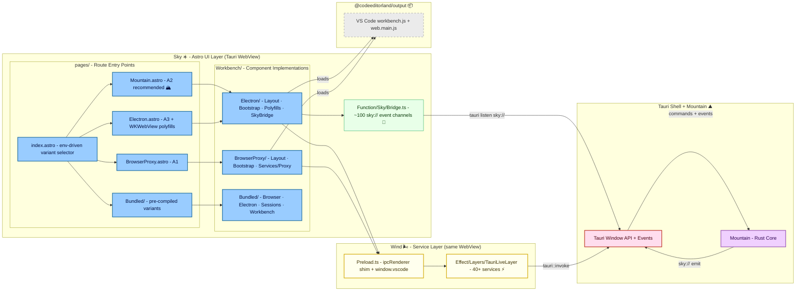

# **Sky** ☀️

<table>
	<tr>
		<td>
			<a href="https://GitHub.Com/CodeEditorLand/Sky" target="_blank">
				<picture>
					<source media="(prefers-color-scheme: dark)" srcset="https://img.shields.io/github/last-commit/CodeEditorLand/Sky?label=Last-commit&color=black&labelColor=black&logoColor=white&logoWidth=0" />
					<source media="(prefers-color-scheme: light)" srcset="https://img.shields.io/github/last-commit/CodeEditorLand/Sky?label=Last-commit&color=white&labelColor=white&logoColor=black&logoWidth=0" />
					
				</picture>
			</a>
			<br />
			<a href="https://GitHub.Com/CodeEditorLand/Sky" target="_blank">
				<picture>
					<source media="(prefers-color-scheme: dark)" srcset="https://img.shields.io/github/issues/CodeEditorLand/Sky?label=Issues&color=black&labelColor=black&logoColor=white&logoWidth=0" />
					<source media="(prefers-color-scheme: light)" srcset="https://img.shields.io/github/issues/CodeEditorLand/Sky?label=Issues&color=white&labelColor=white&logoColor=black&logoWidth=0" />
					
				</picture>
			</a>
		</td>
		<td>
			<a href="https://github.com/CodeEditorLand/Sky" target="_blank">
				<picture>
					<source media="(prefers-color-scheme: dark)" srcset="https://img.shields.io/github/stars/CodeEditorLand/Sky?style=flat&label=Star&logo=github&color=black&labelColor=black&logoColor=white&logoWidth=0" />
					<source media="(prefers-color-scheme: light)" srcset="https://img.shields.io/github/stars/CodeEditorLand/Sky?style=flat&label=Star&logo=github&color=white&labelColor=white&logoColor=black&logoWidth=0" />
					
				</picture>
			</a>
			<br />
			<a href="https://GitHub.Com/CodeEditorLand/Sky" target="_blank">
				<picture>
					<source media="(prefers-color-scheme: dark)" srcset="https://img.shields.io/github/downloads/CodeEditorLand/Sky?label=Downloads&color=black&labelColor=black&logoColor=white&logoWidth=0" />
					<source media="(prefers-color-scheme: light)" srcset="https://img.shields.io/github/downloads/CodeEditorLand/Sky?label=Downloads&color=white&labelColor=white&logoColor=black&logoWidth=0" />
					
				</picture>
			</a>
		</td>
	</tr>
</table>

The UI Component Layer for Land - Astro-based editor interface rendering VS Code
workbench variants.

[](https://github.com/CodeEditorLand/Sky/tree/Current/LICENSE)
[](https://www.npmjs.com/package/@codeeditorland/sky)
[](https://www.npmjs.com/package/astro)
[](https://www.npmjs.com/package/effect)

---

## Overview

`Sky` is the declarative **UI component layer** of the **Land** Code Editor.
Built with the **Astro** framework, `Sky` renders the editor interface - editor,
side bar, activity bar, status bar, and panels - operating within the **Tauri**
webview alongside `Wind`. It consumes state and services from the `Wind` service
layer to display and manage the editor's visual presentation.

`Sky` loads VS Code's core `workbench` from `@codeeditorland/output` and
surrounds it with Astro pages, a Tauri event bridge (`SkyBridge`), and a
Vite/Rollup compilation pipeline that pre-compiles each variant into a
`bundled-workbench` chunk. The `index.astro` entry point selects the active
workbench at build time via environment variables, with conditional dynamic
imports that prevent unused variants from entering Vite's module graph.

---

## Architecture

`Sky` is organized into routes (pages), workbenches (components), and workbench
implementations under `BrowserProxy/`, `Electron/`, and `Bundled/`
subdirectories.



---

## Key Components

| Component           | Path                              | Description                                                                 |
| ------------------- | --------------------------------- | --------------------------------------------------------------------------- |
| index.astro         | `Source/pages/index.astro`        | Dynamic workbench entry point driven by environment variables               |
| SkyBridge           | `Source/Function/Sky/Bridge.ts`   | ~2900-line event router subscribing to ~100 `sky://` channels from Mountain |
| Electron Layout     | `Source/Workbench/Electron/`      | A3 variant: bootstrap, WKWebView polyfills, workbench loader, SkyBridge     |
| BrowserProxy Layout | `Source/Workbench/BrowserProxy/`  | A1 variant: bootstrap, service proxy, workbench loader                      |
| Mountain Workbench  | `Source/Workbench/Mountain.astro` | A2 (recommended) workbench with Mountain-backed providers                   |
| Bundled Variants    | `Source/Workbench/Bundled/`       | Pre-compiled Browser, Electron, Sessions, and Workbench variants            |
| astro.config.ts     | `Source/astro.config.ts`          | ~1450-line Astro + Vite configuration orchestrating the build pipeline      |

### Project Structure

```
Sky/
├── Source/
│   ├── Function/
│   │   ├── Build/VS/Code.ts           # Build pipeline utilities
│   │   ├── Markup/Base.astro          # Shared page layout with CSP
│   │   ├── Meta.astro                 # Meta tag component
│   │   ├── Shared.ts                  # Bust cache, debug toggle
│   │   ├── Sky/Bridge.ts              # SkyBridge event router (~2900 lines)
│   │   ├── Sky/Bridge/                # Router submodules (commands, statusbar, output, etc.)
│   │   ├── Debug.ts                   # Build context logging
│   │   └── SmokeTest/                 # Smoke test utilities
│   ├── pages/
│   │   ├── index.astro                # Dynamic workbench entry (env-driven)
│   │   ├── Browser.astro              # Direct browser workbench page
│   │   ├── BrowserProxy.astro         # A1: Browser + services proxy page
│   │   ├── Electron.astro             # A3: Electron + polyfills page
│   │   ├── Isolation.astro            # Tauri isolation hook
│   │   ├── Mountain.astro             # A2: Mountain providers page (RECOMMENDED)
│   │   └── Bundled/
│   │       ├── Browser.astro          # Bundled browser variant entry
│   │       ├── Electron.astro         # Bundled electron variant entry
│   │       ├── Sessions.astro         # Bundled sessions variant entry
│   │       └── Workbench.astro        # Bundled workbench variant entry
│   ├── Workbench/
│   │   ├── Browser.astro              # Minimal browser workbench loader
│   │   ├── BrowserTest.astro          # Test entry with smoke test driver
│   │   ├── Default.astro              # DEPRECATED entry point
│   │   ├── Mountain.astro             # A2 workbench with phase advance
│   │   ├── NLS.astro                  # NLS configuration script
│   │   ├── TelemetryBridge.astro      # PostHog telemetry script
│   │   ├── BrowserProxy/
│   │   │   ├── Bootstrap.ts           # Effect-TS bootstrap
│   │   │   ├── Layout.astro           # Sequential load: preload -> bootstrap -> workbench
│   │   │   ├── Workbench.ts           # VS Code browser workbench loader
│   │   │   ├── Services/Proxy.ts      # Mountain service proxy layer
│   │   │   └── Wind/Preload.ts        # Wind environment shim
│   │   ├── Electron/
│   │   │   ├── Bootstrap.ts           # Effect-TS bootstrap
│   │   │   ├── Layout.astro           # Sequential: preload -> polyfills -> bootstrap -> workbench -> SkyBridge
│   │   │   ├── Workbench.ts           # Electron workbench with WKWebView polyfills
│   │   │   ├── Polyfills.ts           # requestIdleCallback, queryLocalFonts, __name, Blob
│   │   │   ├── Wind/Preload.ts        # Wind environment shim
│   │   │   ├── Traceparent/Bridge.ts  # Traceparent propagation
│   │   │   ├── OTELBridge.ts          # OpenTelemetry bridge
│   │   │   ├── WorkerBundleImports.astro
│   │   │   └── Extension/Change/Subscriber.ts
│   │   └── Bundled/
│   │       ├── Browser/               # Bundled browser variant
│   │       ├── Electron/              # Bundled electron variant
│   │       ├── Sessions/              # Bundled sessions variant
│   │       └── Workbench/             # Bundled workbench variant
│   └── env.d.ts                       # TypeScript environment declarations
├── Public/                # Static assets (favicon, manifest, product.json, robots.txt)
├── Target/                # Build output
├── astro.config.ts        # Astro + Vite configuration (~1450 lines)
├── package.json
├── tsconfig.json
└── jsconfig.json
```

### Core Architecture Principles

| Principle           | Description                                                                                            | Key Components                                                                              |
| :------------------ | :----------------------------------------------------------------------------------------------------- | :------------------------------------------------------------------------------------------ |
| **Compatibility**   | High-fidelity VS Code UI rendering to maximize compatibility with extensions and workflows             | `Workbench/*`, `Workbench/BrowserProxy/*`, `Workbench/Electron/*`, `@codeeditorland/output` |
| **Modularity**      | Pages, workbenches, and layouts organized into distinct, cohesive modules                              | `pages/*`, `Workbench/*`, `Function/*`                                                      |
| **Performance**     | Astro's static generation and selective hydration minimize JavaScript payload                          | Astro build system, Component Islands                                                       |
| **Integration**     | Seamless connection with Wind services and Mountain backend through Tauri events and IPC               | `SkyBridge`, `Install`, `Bootstrap`, Tauri event listeners                                  |
| **Maintainability** | UI state driven by Wind services for predictable data flow; clear boundary between rendering and logic | Service consumption pattern, Event-driven updates                                           |

### Workbench Variants

| Variant                        | Description                                                                                                  |
| :----------------------------- | :----------------------------------------------------------------------------------------------------------- |
| **A1: Browser/BrowserProxy**   | Browser workbench with optional service proxy                                                                |
| **A2: Mountain (recommended)** | Browser workbench with Mountain-backed providers via full IPC chain                                          |
| **A3: Electron**               | Electron workbench with WKWebView polyfills (`requestIdleCallback`, `queryLocalFonts`, `__name`, Blob patch) |
| **Bundled**                    | Pre-compiled Vite/Rollup chunks under `Target/Static/Bundled/<Variant>/`                                     |

---

## In the Land Project

`Sky` is the UI layer that renders inside the Tauri WebView, consuming Wind's
Effect-TS services. It connects the user interface to the Mountain backend
through Tauri's IPC and event system.

- **Depends on:** `Wind` (service layer), `@codeeditorland/output` (VS Code
  workbench bundles), `Mountain` (backend via Tauri IPC)
- **Consumed by:** End users (the editor UI)
- **Protocol:** Tauri IPC (`invoke` + `listen`), `sky://` Tauri events

---

## Getting Started

```sh
pnpm add @codeeditorland/sky
```

**Key Dependencies:**

| Package                            | Purpose                                          |
| :--------------------------------- | :----------------------------------------------- |
| `astro`                            | UI framework (v6.x)                              |
| `@codeeditorland/wind`             | Effect-TS service layer                          |
| `@codeeditorland/common`           | Rust core bindings and IPC type definitions      |
| `@codeeditorland/output`           | VS Code output bundle and transform plugins      |
| `@codeeditorland/worker`           | Web worker implementations                       |
| `@codeeditorland/cocoon`           | Cocoon service layer                             |
| `@playform/build`                  | Build pipeline integration                       |
| `@playform/compress`               | Post-build HTML/CSS/JS compression               |
| `@playform/inline`                 | Inline critical assets                           |
| `@xterm/xterm`                     | Web terminal (v6.1.0-beta)                       |
| `@xterm/addon-*`                   | Terminal addons (clipboard, image, search, etc.) |
| `@vscode/vscode-languagedetection` | Language detection for editor                    |
| `effect`                           | Functional effect system (via wind)              |
| `zod`                              | Schema validation (v4.x)                         |
| `deepmerge-ts`                     | Deep merge utilities                             |
| `dotenv`                           | Environment variable loading                     |
| `vite`                             | Module bundler (v8.x)                            |

### Usage

Select the workbench at runtime via environment variables:

```bash
# A2: Mountain workbench (RECOMMENDED)
Mountain=true pnpm run Run

# A3: Electron workbench
Electron=true pnpm run Run

# A1: Browser Proxy workbench
BrowserProxy=true pnpm run Run

# A1: Bare browser workbench
Browser=true pnpm run Run

# Bundled mode (pre-compiled variants)
Bundle=true Pack="electron browser" pnpm run Run
```

Or import workbench components directly:

```astro
---
import MountainWorkbench from "../Workbench/Mountain.astro";
---

<html>
	<body>
		<MountainWorkbench />
	</body>
</html>
```

---

## API Reference

- [SkyBridge Event Channels](https://github.com/CodeEditorLand/Sky/tree/Current/Source/Function/Sky/Bridge.ts)
    - Complete event routing for ~100 `sky://` channels
- [Page Routes](https://github.com/CodeEditorLand/Sky/tree/Current/Source/pages/)
    - All entry point pages
- [Workbench Implementations](https://github.com/CodeEditorLand/Sky/tree/Current/Source/Workbench/)
    - Layout, bootstrap, and workbench loader components

---

## Related Documentation

- [Architecture Overview](https://Editor.Land/Doc/architecture) - Internal
  module structure
- [Why Tauri](https://Editor.Land/Doc/why-tauri) - Design rationale for Tauri
- [Land Documentation](../../Documentation/GitHub/README.md) - Complete
  documentation index
- [Wind 🌬️](https://github.com/CodeEditorLand/Wind) - Service layer that Sky
  consumes
- [Cocoon 🦋](https://github.com/CodeEditorLand/Cocoon) - Extension host sidecar
  (correlated frontend element)
- [Worker ⚙️](https://github.com/CodeEditorLand/Worker) - Service worker for
  caching and offline support

---

## License

This project is released into the public domain under the **Creative Commons CC0
Universal** license. You are free to use, modify, distribute, and build upon
this work for any purpose, without any restrictions. For the full legal text,
see the [`LICENSE`](https://github.com/CodeEditorLand/Sky/tree/Current/LICENSE)
file.

---

## Changelog

See
[`CHANGELOG.md`](https://github.com/CodeEditorLand/Sky/tree/Current/CHANGELOG.md)
for a history of changes specific to **Sky** ☀️.

---

## Funding

This project is funded through
[NGI0 Commons Fund](https://NLnet.NL/commonsfund), a fund established by
[NLnet](https://NLnet.NL) with financial support from the European Commission's
Next Generation Internet program, under grant agreement No 101135429.

<table>
	<tbody>
		<tr>
			<td align="left" valign="middle">
				<a href="https://Editor.Land">
					
				</a>
			</td>
			<td align="left" valign="middle">
				<a href="https://PlayForm.Cloud">
					
				</a>
			</td>
			<td align="left" valign="middle">
				<a href="https://NLnet.NL">
					
				</a>
			</td>
			<td align="left" valign="middle">
				<a href="https://NLnet.NL/commonsfund">
					
				</a>
			</td>
		</tr>
	</tbody>
</table>

---

**Project Maintainers**: Source Open
([Source/Open@editor.land](mailto:Source/Open@editor.land)) |
[GitHub Repository](https://github.com/CodeEditorLand/Sky) |
[Report an Issue](https://github.com/CodeEditorLand/Sky/issues) |
[Security Policy](https://github.com/CodeEditorLand/Sky/security/policy)
