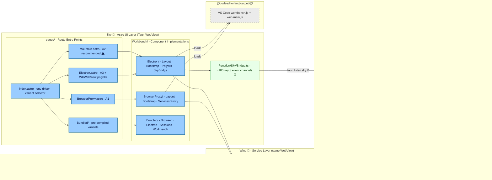

<table>
	<tr>
		<td align="left" valign="middle">
			<h3 align="left">Sky&#x2001;🌌</h3>
		</td>
		<td align="left" valign="middle">
			<h3 align="left">&#x2001;+&#x2001;</h3>
		</td>
		<td align="left" valign="middle">
			<h3 align="left">
				<a href="https://Land.PlayForm.Cloud" target="_blank">
					<picture>
						<source media="(prefers-color-scheme: dark)" srcset="https://PlayForm.Cloud/Dark/Image/GitHub/Land.svg">
						<source media="(prefers-color-scheme: light)" srcset="https://PlayForm.Cloud/Image/GitHub/Land.svg">
						
					</picture>
				</a>
			</h3>
		</td>
		<td align="left" valign="middle">
			<h3 align="left">
				<a href="https://Land.PlayForm.Cloud" target="_blank">Land&#x2001;🏞️</a>
			</h3>
		</td>
	</tr>
</table>

---

# **Sky**&#x2001;🌌

The UI Component Layer for `Land`&#x2001;🏞️.

[](https://github.com/CodeEditorLand/Sky/tree/Current/LICENSE)
[](https://www.npmjs.com/package/@codeeditorland/sky)
[](https://www.npmjs.com/package/astro)
[](https://www.npmjs.com/package/effect)

Welcome to **Sky**&#x2001;🌌, the declarative **UI component layer** of the
**Land**&#x2001;🏞️ Code Editor. Built with the **`Astro`** framework, `Sky`
renders the user interface -- editor, side bar, activity bar, status bar, and
panels. It operates within the **`Tauri`** webview alongside `Wind`, consuming
state and services from the `Wind` service layer to display and manage the
editor's visual presentation.

**Sky** loads `VS Code`'s core `workbench` from `@codeeditorland/output` and
surrounds it with `Astro` pages, a `Tauri` event bridge (`SkyBridge`), and a
`Vite`/`Rollup` compilation pipeline that pre-compiles each variant into a
`bundled-workbench` chunk. The `index.astro` entry point selects the active
workbench at build time via environment variables, with conditional dynamic
imports that prevent unused variants from entering `Vite`'s module graph.

**Sky** is engineered to render a comprehensive set of `Astro`-based components
that compose the editor interface, support multiple workbench variants for
different deployment scenarios, integrate with `Wind`'s `Effect-TS`-powered
services for state management, and manage page routing inside the `Tauri`
webview.

---

## Key Features&#x2001;🔐

**Astro-Based Component Architecture.** Leverages Astro's component islands
approach for efficient, content-driven UI development with zero JavaScript by
default and selective hydration for interactive components. The
`astro.config.ts` file orchestrates a complex build pipeline that copies,
patches, and transforms VS Code output assets through the
`@codeeditorland/output` plugin system while keeping Sky-specific steps (config
backfill, performance markings, extension npm installs) inline where they
require Mountain IPC or external-process knowledge.

**VS Code UI Compatibility.** Provides multiple workbench approaches that load
and integrate VS Code's core UI components from `@codeeditorland/output`,
ensuring high-fidelity editor experience. The build pipeline copies
`vs/code/browser/workbench/workbench.js` and
`vs/code/electron-browser/workbench/ workbench.js` from the Output tree and
applies runtime patches for error surfacing, config backfill (colorScheme,
profiles, detectedProfiles, backupPath), and diagnostic performance markings.

**SkyBridge Event System.** A ~2900-line TypeScript module subscribes to all
`sky://` events emitted by Mountain via Tauri's `listen()` IPC and routes them
to VS Code workbench APIs through the `__CEL_SERVICES__` accessor. The bridge
covers ~100 event channels spanning editor operations, output channels, status
bar entries, command execution, search providers, progress notifications,
terminal management, webview lifecycle, and dialog requests. Reentrancy is
guarded so double-calls during HMR or webview reloads do not duplicate
listeners.

**Wind Service Layer Integration.** Seamlessly consumes Wind's Effect-TS
services for file operations, dialogs, configuration, and state management,
enabling a clean separation between UI and business logic. Each workbench
variant loads Wind's preload shim, bootstrap, and optional Mountain-backed
providers in sequential order so that service globals are available before the
workbench imports.

**Flexible Workbench Variants.** Supports multiple workbench approaches through
environment-based selection. A1 (Browser/BrowserProxy) uses the browser
workbench with optional service proxy. A2 (Mountain, recommended) runs the
browser workbench with Mountain-backed providers via the full IPC chain. A3
(Electron) uses the Electron workbench with WKWebView polyfills for
`requestIdleCallback`, `queryLocalFonts`, `__name`, and a Blob patch that
rewrites `vscode-file://` URLs to HTTP origins.

**Bundled Workbench Pipeline.** When `Pack` is set to a space-separated list of
variants (`electron`, `browser`, `sessions`, `workbench`), the build produces
`Vite`/`Rollup`-compiled workbench chunks under
`Target/Static/Bundled/<Variant>/`. Each variant's `Entry.ts` imports the
corresponding `VS Code` workbench module, and the page-level conditional import
ensures only selected variants enter the module graph. This avoids pulling
`gulp`-only `out/` files with property-mangled symbol mismatches into the
`Rollup` bundle.

**Component Modularity.** Organized into pages (routes), workbenches
(components), and workbench implementations under `BrowserProxy/`, `Electron/`,
and `Bundled/` subdirectories for clear separation of concerns and
maintainability.

**Tauri Webview Integration.** Runs within the Tauri webview, communicating with
the Mountain backend through Tauri's IPC mechanism and event system for native
OS capabilities. The isolation hook in `Isolation.astro` provides a pluggable
point for Tauri's isolation pattern.

---

## Core Architecture Principles&#x2001;🏗️

| Principle           | Description                                                                                             | Key Components                                                                              |
| :------------------ | :------------------------------------------------------------------------------------------------------ | :------------------------------------------------------------------------------------------ |
| **Compatibility**   | High-fidelity VS Code UI rendering to maximize compatibility with extensions and workflows.             | `Workbench/*`, `Workbench/BrowserProxy/*`, `Workbench/Electron/*`, `@codeeditorland/output` |
| **Modularity**      | Pages, workbenches, and layouts organized into distinct, cohesive modules.                              | `pages/*`, `Workbench/*`, `Workbench/BrowserProxy/*`, `Workbench/Electron/*`, `Function/*`  |
| **Performance**     | Astro's static generation and selective hydration minimize JavaScript payload.                          | Astro build system, Component Islands                                                       |
| **Integration**     | Seamless connection with Wind services and Mountain backend through Tauri events and IPC.               | `SkyBridge`, `Install`, `Bootstrap`, Tauri event listeners                                  |
| **Maintainability** | UI state driven by Wind services for predictable data flow; clear boundary between rendering and logic. | Service consumption pattern, Event-driven updates                                           |

---

## `Sky` in the `Land`&#x2001;🏞️ Ecosystem&#x2001;🌌

| Component              | Role & Key Responsibilities                                                                                            |
| :--------------------- | :--------------------------------------------------------------------------------------------------------------------- |
| **Astro Components**   | Declarative UI building blocks composing the editor interface, from activity bar to status bar.                        |
| **Tauri Webview**      | Runtime environment where Sky executes, providing access to Tauri APIs and OS integration.                             |
| **Wind Integration**   | Consumes Wind's Effect-TS services for file operations, dialogs, configuration, and state management.                  |
| **Workbench Variants** | Three approaches (A1-A3) for loading VS Code's core editor components: Browser, Mountain (recommended), and Electron.  |
| **Page Routing**       | Manages navigation between index (default), Browser, BrowserProxy, Electron, Mountain, and Isolation pages.            |
| **SkyBridge**          | Subscribes to sky:// Tauri events from Mountain and routes them to VS Code workbench APIs via the CEL accessor system. |
| **Event Handling**     | Listens for Tauri events from Mountain to update UI state including terminal output, SCM updates, and configuration.   |

---

## Interaction Flow: Rendering UI from Wind State&#x2001;🔄

Page Load. User navigates to `/`, which loads `index.astro`. The page reads
environment variables to determine which workbench to load. When `Mountain=true`
it loads the A2 Mountain workbench. When `Electron=true` it loads A3 Electron.
When `BrowserProxy=true` it loads A1 Browser Proxy. When `Bundle=true` and a
matching variant exists in `Pack`, it loads the pre-compiled bundled layout.
With no variables set, it defaults to the Browser workbench.

Wind Bootstrap. The workbench component imports and executes the
`@codeeditorland/wind` preload shim and Effect-TS bootstrap, which installs the
environment shim and initializes the service layers. Each variant sequences its
loads (Preload, Polyfills, Bootstrap, Workbench, SkyBridge) so that globals from
earlier steps are available when subsequent steps execute.

Service Consumption. Sky components subscribe to Wind services through the
`__CEL_SERVICES__` accessor that the Output transform plugin exposes on
`globalThis`. The StatusbarService, CommandService, SearchService, and
TreeViewByViewId services are all resolved after the workbench's `web.main.js`
runs its `createDecorator` registrations.

Event Listening. SkyBridge listens for Tauri events from Mountain across roughly
100 `sky://` channels. The `sky://editor/openDocument` event triggers a
`vscode.open` command. The `sky://output/append` event writes text to a named
output channel. The `sky://statusbar/update` event updates entries on the native
status bar. The `sky://command/execute` event runs arbitrary workbench commands.
The `sky://progress/*` channels manage progress notification lifecycles. The
`sky://terminal/*` channels control terminal visibility and sizing.

User Interaction. When a user action requires backend communication, such as
opening a file, the Sky component calls a Wind service which invokes Tauri's
native dialog through the Mountain IPC layer. The result flows back through Wind
to Sky, which updates the editor component to display the opened file.

---

## System Architecture Diagram&#x2001;🏗️



---

## Project Structure Overview&#x2001;🗺️

```
Sky/
├── Source/
│   ├── Function/
│   │   ├── Build/VS/Code.ts           # Build pipeline utilities
│   │   ├── Markup/Base.astro          # Shared page layout with CSP
│   │   ├── Meta.astro                 # Meta tag component
│   │   ├── Shared.ts                  # Bust cache, debug toggle
│   │   ├── Sky/Bridge.ts              # SkyBridge event router (~2900 lines)
│   │   ├── Sky/Bridge/                # Router submodules (commands, statusbar, output, etc.)
│   │   ├── Debug.ts                   # Build context logging
│   │   └── SmokeTest/                 # Smoke test utilities
│   ├── pages/
│   │   ├── index.astro                # Dynamic workbench entry (env-driven)
│   │   ├── Browser.astro              # Direct browser workbench page
│   │   ├── BrowserProxy.astro         # A1: Browser + services proxy page
│   │   ├── Electron.astro             # A3: Electron + polyfills page
│   │   ├── Isolation.astro            # Tauri isolation hook
│   │   ├── Mountain.astro             # A2: Mountain providers page (RECOMMENDED)
│   │   └── Bundled/
│   │       ├── Browser.astro          # Bundled browser variant entry
│   │       ├── Electron.astro         # Bundled electron variant entry
│   │       ├── Sessions.astro         # Bundled sessions variant entry
│   │       └── Workbench.astro        # Bundled workbench variant entry
│   ├── Workbench/
│   │   ├── Browser.astro              # Minimal browser workbench loader
│   │   ├── BrowserTest.astro          # Test entry with smoke test driver
│   │   ├── Default.astro              # DEPRECATED entry point
│   │   ├── Mountain.astro             # A2 workbench with phase advance
│   │   ├── NLS.astro                  # NLS configuration script
│   │   ├── TelemetryBridge.astro      # PostHog telemetry script
│   │   ├── BrowserProxy/
│   │   │   ├── Bootstrap.ts           # Effect-TS bootstrap
│   │   │   ├── Layout.astro           # Sequential load: preload -> bootstrap -> workbench
│   │   │   ├── Workbench.ts           # VS Code browser workbench loader
│   │   │   ├── Services/Proxy.ts      # Mountain service proxy layer
│   │   │   └── Wind/Preload.ts        # Wind environment shim
│   │   ├── Electron/
│   │   │   ├── Bootstrap.ts           # Effect-TS bootstrap
│   │   │   ├── Layout.astro           # Sequential: preload -> polyfills -> bootstrap -> workbench -> SkyBridge
│   │   │   ├── Workbench.ts           # Electron workbench with WKWebView polyfills
│   │   │   ├── Polyfills.ts           # requestIdleCallback, queryLocalFonts, __name, Blob
│   │   │   ├── Wind/Preload.ts        # Wind environment shim
│   │   │   ├── Traceparent/Bridge.ts  # Traceparent propagation
│   │   │   ├── OTELBridge.ts          # OpenTelemetry bridge
│   │   │   ├── WorkerBundleImports.astro
│   │   │   └── Extension/Change/Subscriber.ts
│   │   └── Bundled/
│   │       ├── Browser/               # Bundled browser variant
│   │       ├── Electron/              # Bundled electron variant
│   │       ├── Sessions/              # Bundled sessions variant
│   │       └── Workbench/             # Bundled workbench variant
│   └── env.d.ts                       # TypeScript environment declarations
├── Public/                # Static assets (favicon, manifest, product.json, robots.txt)
├── Target/                # Build output
├── astro.config.ts        # Astro + Vite configuration (~1450 lines)
├── package.json
├── tsconfig.json
└── jsconfig.json
```

---

## Getting Started&#x2001;🚀

### Installation&#x2001;📥

```sh
pnpm add @codeeditorland/sky
```

**Key Dependencies:**

| Package                            | Purpose                                          |
| :--------------------------------- | :----------------------------------------------- |
| `astro`                            | UI framework (v6.x)                              |
| `@codeeditorland/wind`             | Effect-TS service layer                          |
| `@codeeditorland/common`           | Rust core bindings and IPC type definitions      |
| `@codeeditorland/output`           | VS Code output bundle and transform plugins      |
| `@codeeditorland/worker`           | Web worker implementations                       |
| `@codeeditorland/cocoon`           | Cocoon service layer                             |
| `@playform/build`                  | Build pipeline integration                       |
| `@playform/compress`               | Post-build HTML/CSS/JS compression               |
| `@playform/inline`                 | Inline critical assets                           |
| `@xterm/xterm`                     | Web terminal (v6.1.0-beta)                       |
| `@xterm/addon-*`                   | Terminal addons (clipboard, image, search, etc.) |
| `@vscode/vscode-languagedetection` | Language detection for editor                    |
| `effect`                           | Functional effect system (via wind)              |
| `zod`                              | Schema validation (v4.x)                         |
| `deepmerge-ts`                     | Deep merge utilities                             |
| `dotenv`                           | Environment variable loading                     |
| `vite`                             | Module bundler (v8.x)                            |

### Usage Pattern&#x2001;🚀

Select the workbench at runtime via environment variables:

```bash
# A2: Mountain workbench (RECOMMENDED)
Mountain=true pnpm run Run

# A3: Electron workbench
Electron=true pnpm run Run

# A1: Browser Proxy workbench
BrowserProxy=true pnpm run Run

# A1: Bare browser workbench
Browser=true pnpm run Run

# Bundled mode (pre-compiled variants)
Bundle=true Pack="electron browser" pnpm run Run
```

Or import workbench components directly:

```astro
---
import MountainWorkbench from "../Workbench/Mountain.astro";
---

<html>
	<body>
		<MountainWorkbench />
	</body>
</html>
```

---

## See Also&#x2001;🔗

- [Sky Documentation](https://land.playform.cloud/Doc/sky)
- [Architecture Overview](https://land.playform.cloud/Doc/architecture)
- [Why `Tauri`](https://land.playform.cloud/Doc/why-tauri)
- [`Wind`](https://github.com/CodeEditorLand/Wind)
- [`Mountain`](https://github.com/CodeEditorLand/Mountain)

---

## License&#x2001;⚖️

This project is released into the public domain under the **Creative Commons CC0
Universal** license. You are free to use, modify, distribute, and build upon
this work for any purpose, without any restrictions. For the full legal text,
see the [`LICENSE`](https://github.com/CodeEditorLand/Sky/tree/Current/LICENSE)
file.

---

## Changelog&#x2001;📜

See
[`CHANGELOG.md`](https://github.com/CodeEditorLand/Sky/tree/Current/CHANGELOG.md)
for a history of changes specific to **Sky**&#x2001;🌌.

---

## Funding & Acknowledgements&#x2001;🙏🏻

**Sky** is a core element of the **Land**&#x2001;🏞️ ecosystem.&#x2001;🌌 project
is funded through [NGI0 Commons Fund](https://NLnet.NL/commonsfund), a fund
established by [NLnet](https://NLnet.NL) with financial support from the
European Commission's [Next Generation Internet](https://ngi.eu) program. Learn
more at the [NLnet project page](https://NLnet.NL/project/Land).

The project is operated by PlayForm, based in Sofia, Bulgaria.

PlayForm acts as the open-source steward for Code Editor Land under the NGI0
Commons Fund grant.

<table>
	<thead>
		<tr>
			<th align="left"><strong>Land</strong></th>
			<th align="left"><strong>PlayForm</strong></th>
			<th align="left"><strong>NLnet</strong></th>
			<th align="left"><strong>NGI0 Commons Fund</strong></th>
		</tr>
	</thead>
	<tbody>
		<tr>
			<td align="left" valign="middle">
				<a href="https://Land.PlayForm.Cloud">
					
				</a>
			</td>
			<td align="left" valign="middle">
				<a href="https://PlayForm.Cloud">
					
				</a>
			</td>
			<td align="left" valign="middle">
				<a href="https://NLnet.NL">
					
				</a>
			</td>
			<td align="left" valign="middle">
				<a href="https://NLnet.NL/commonsfund">
					
				</a>
			</td>
		</tr>
	</tbody>
</table>

---

**Project Maintainers**: Source Open
([Source/Open@Land.PlayForm.Cloud](mailto:Source/Open@Land.PlayForm.Cloud)) |
[GitHub Repository](https://github.com/CodeEditorLand/Sky) |
[Report an Issue](https://github.com/CodeEditorLand/Sky/issues) |
[Security Policy](https://github.com/CodeEditorLand/Sky/security/policy)
