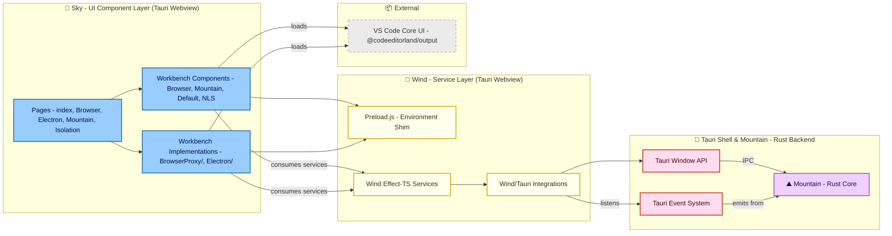

<table>
	<tr>
		<td align="left" valign="middle">
			<h3 align="left">Sky&#x2001;🌌</h3>
		</td>
		<td align="left" valign="middle">
			<h3 align="left">&#x2001;+&#x2001;</h3>
		</td>
		<td align="left" valign="middle">
			<h3 align="left">
				<a href="https://Editor.Land" target="_blank">
					<picture>
						<source media="(prefers-color-scheme: dark)" srcset="https://PlayForm.Cloud/Dark/Image/GitHub/Land.svg">
						<source media="(prefers-color-scheme: light)" srcset="https://PlayForm.Cloud/Image/GitHub/Land.svg">
						
					</picture>
				</a>
			</h3>
		</td>
		<td align="left" valign="middle">
			<h3 align="left">
				<a href="https://Editor.Land" target="_blank">Land&#x2001;🏞️</a>
			</h3>
		</td>
	</tr>
</table>

---

# **Sky**&#x2001;🌌

The UI Component Layer for `Land`&#x2001;🏞️.

[](https://github.com/CodeEditorLand/Land/tree/Current/LICENSE)
[](https://www.npmjs.com/package/@codeeditorland/sky)
[](https://www.npmjs.com/package/astro)
[](https://www.npmjs.com/package/effect)

Welcome to **Sky**&#x2001;🌌, the declarative **UI component layer** of the
**Land**&#x2001;🏞️ Code Editor. Built with the **`Astro`** framework, `Sky` renders
the user interface - editor, side bar, activity bar, status bar, and panels. It
operates within the **`Tauri`** webview alongside `Wind`, consuming state and
services from the `Wind` service layer to display and manage the editor's visual
presentation.

**Sky** is engineered to:

1. **Render UI Components:** Provide a comprehensive set of `Astro`-based
   components that compose the `Land` editor interface.
2. **Support Multiple Workbench Variants:** Offer distinct workbench approaches
   (Browser, Mountain, Electron) for different deployment scenarios.
3. **Integrate with `Wind` Services:** Consume `Wind`'s `Effect-TS`-powered
   services for state management and backend communication.
4. **Enable Page Routing:** Manage application navigation and page transitions
   within the `Tauri` webview.

---

## Key Features&#x2001;🔐

- **`Astro`-Based Component Architecture:** Leverages `Astro`'s component
  islands architecture for efficient, content-driven UI development with zero
  `JavaScript` by default and selective hydration for interactive components.
- **`VS Code` UI Compatibility:** Provides multiple workbench approaches that
  load and integrate `VS Code`'s core UI components from
  `@codeeditorland/output`, ensuring high-fidelity editor experience.
- **`Wind` Service Layer Integration:** Seamlessly consumes `Wind`'s `Effect-TS`
  services for file operations, dialogs, configuration, and state management,
  enabling a clean separation between UI and business logic.
- **`Tauri` Webview Integration:** Runs within the `Tauri` webview,
  communicating with the `Mountain` backend through `Tauri`'s IPC mechanism and
  event system for native OS capabilities.
- **Flexible Workbench Variants:** Supports multiple workbench approaches
  through environment-based selection:
  - **A1 (Browser/BrowserProxy):** Browser-based workbench with optional service
    proxy.
  - **A2 (Mountain - RECOMMENDED):** Browser workbench with Mountain-backed
    providers.
  - **A3 (Electron):** Electron workbench with polyfills for `VS Code`.
- **Component Modularity:** Organized into Pages (routes), Workbenches
  (components), and Workbench Implementations (`BrowserProxy/`, `Electron/`
  subdirectories) for clear separation of concerns and maintainability.

---

## Core Architecture Principles&#x2001;🏗️

| Principle           | Description                                                                                                                           | Key Components                                                                                      |
| :------------------ | :------------------------------------------------------------------------------------------------------------------------------------ | :-------------------------------------------------------------------------------------------------- |
| **Compatibility**   | High-fidelity `VS Code` UI rendering to maximize compatibility with extensions and workflows.                                         | `Workbench/*`, `Workbench/BrowserProxy/*`, `Workbench/Electron/*`, `@codeeditorland/output`         |
| **Modularity**      | Pages, workbenches, and layouts organized into distinct, cohesive modules.                                                            | `pages/*`, `Workbench/*`, `Workbench/BrowserProxy/*`, `Workbench/Electron/*`, `Function/*`          |
| **Performance**     | `Astro`'s static generation and selective hydration minimize `JavaScript` payload.                                                    | `Astro` build system, Component Islands                                                             |
| **Integration**     | Seamless connection with `Wind` services and `Mountain` backend through `Tauri` events and IPC.                                       | `Install`, `Bootstrap`, `Tauri` event listeners                                                     |
| **Maintainability** | UI state driven by `Wind` services for predictable data flow; clear boundary between rendering and logic.                             | Service consumption pattern, Event-driven updates                                                   |

---

## `Sky`&#x2001;🌌 in the `Land`&#x2001;🏞️ Ecosystem

| Component              | Role & Key Responsibilities                                                                                                              |
| :--------------------- | :--------------------------------------------------------------------------------------------------------------------------------------- |
| **`Astro` Components** | Declarative UI building blocks composing the editor interface, from activity bar to status bar.                                          |
| **`Tauri` Webview**    | Runtime environment where `Sky` executes, providing access to `Tauri` APIs and OS integration.                                          |
| **`Wind` Integration** | Consumes `Wind`'s `Effect-TS` services for file operations, dialogs, configuration, and state management.                               |
| **Workbench Variants** | Three approaches (A1–A3) for loading `VS Code`'s core editor components: Browser, Mountain (recommended), and Electron.               |
| **Page Routing**       | Manages navigation between `index` (default), `Browser`, `BrowserProxy`, `Electron`, `Mountain`, and `Isolation` pages.                 |
| **Event Handling**     | Listens for `Tauri` events from `Mountain` to update UI state (terminal output, SCM updates, configuration changes).                     |

---

## Interaction Flow: Rendering UI from `Wind` State&#x2001;🔄

1. **Page Load:** User navigates to `/`, which loads `index.astro`.
2. **Workbench Selection:** The page reads environment variables to determine
   which workbench to load:
   - `Mountain=true` → Loads the recommended A2: `Mountain` workbench.
   - `Electron=true` → Loads A3: `Electron` workbench.
   - `BrowserProxy=true` → Loads A1: Browser Proxy workbench.
   - `Browser=true` → Loads A1: Browser workbench.
   - Default → Loads `Workbench/Default.astro`.
3. **`Wind` Bootstrap:** The workbench imports and executes `@codeeditorland/wind`
   bootstrap, which installs the `Preload.ts` environment shim and initializes
   `Effect-TS` runtime and service layers.
4. **Service Consumption:** `Sky` components subscribe to `Wind` services:
   - `StatusBarService` → Updates status bar items.
   - `ActivityBarService` → Manages activity bar state.
   - `FileSystemService` → Provides file tree data to the sidebar.
5. **Event Listening:** `Sky` listens for `Tauri` events from `Mountain`:
   - `sky://terminal/data` → Renders `xterm.js` terminal output in panel.
   - `sky://scm/update-group` → Updates source control view.
   - `sky://configuration/changed` → Re-renders affected UI components.
6. **User Interaction:** When user clicks “Open File”:
   - `Sky` component calls `Wind`'s `DialogService.showOpenDialog()`.
   - `Wind` invokes `Tauri`'s native dialog via `@tauri-apps/plugin-dialog`.
   - Selected file URI is returned through `Wind` to `Sky`.
   - `Sky` updates the editor component to display the opened file.

---

## System Architecture Diagram&#x2001;🏗️



---

## Project Structure Overview&#x2001;🗺️

```
Sky/
├── Source/
│   ├── pages/
│   │   ├── index.astro            # Home page (default workbench entry)
│   │   ├── Browser.astro          # A1: Browser workbench page
│   │   ├── BrowserProxy.astro     # A1: Browser + services proxy page
│   │   ├── Electron.astro         # A3: Electron + polyfills page
│   │   ├── Isolation.astro        # Isolated mode page
│   │   └── Mountain.astro         # A2: Mountain providers page (RECOMMENDED)
│   ├── Workbench/
│   │   ├── Default.astro          # Deprecated entry point
│   │   ├── Browser.astro
│   │   ├── BrowserTest.astro
│   │   ├── Mountain.astro         # A2 (RECOMMENDED)
│   │   ├── NLS.astro
│   │   ├── BrowserProxy/          # A1 implementation
│   │   └── Electron/              # A3 implementation
│   ├── Function/              # Utility functions and base components
│   └── env.d.ts
├── Public/                # Static assets
├── Target/                # Build output
├── .env.example
├── astro.config.ts
├── package.json
└── tsconfig.json
```

---

## Getting Started&#x2001;🚀

### Installation&#x2001;📥

```sh
pnpm add @codeeditorland/sky
```

**Key Dependencies:**

| Package                        | Purpose                              |
| :----------------------------- | :----------------------------------- |
| `astro`                        | UI framework (current stable)        |
| `@codeeditorland/wind`         | Service layer                        |
| `@codeeditorland/common`       | Rust core bindings                   |
| `@codeeditorland/output`       | `VS Code` output bundle              |
| `@codeeditorland/worker`       | Web worker implementations           |

### Usage Pattern&#x2001;🚀

Select the workbench at runtime via environment variables:

```bash
# A2: Mountain workbench (RECOMMENDED)
Mountain=true pnpm run Run

# A3: Electron workbench
Electron=true pnpm run Run

# A1: Browser Proxy workbench
BrowserProxy=true pnpm run Run
```

Or import workbench components directly:

```astro
---
import MountainWorkbench from "../Workbench/Mountain.astro";
---

<html>
	<body>
		<MountainWorkbench />
	</body>
</html>
```

---

## See Also&#x2001;🔗

- [Sky Documentation](https://editor.land/Doc/sky)
- [Architecture Overview](https://editor.land/Doc/architecture)
- [Why `Tauri`](https://editor.land/Doc/why-tauri)
- [`Wind`](https://github.com/CodeEditorLand/Wind)
- [`Mountain`](https://github.com/CodeEditorLand/Mountain)

---

## License&#x2001;⚖️

This project is released into the public domain under the **Creative Commons CC0
Universal** license. You are free to use, modify, distribute, and build upon
this work for any purpose, without any restrictions. For the full legal text,
see the [`LICENSE`](https://github.com/CodeEditorLand/Land/tree/Current/LICENSE)
file.

---

## Changelog&#x2001;📜

See [`CHANGELOG.md`](../../CHANGELOG.md) for a history of changes specific to
**Sky**&#x2001;🌌.

---

## Funding \& Acknowledgements&#x2001;🙏🏻

**Sky**&#x2001;🌌 is a core element of the **Land**&#x2001;🏞️ ecosystem. This project is
funded through [NGI0 Commons Fund](https://NLnet.NL/commonsfund), a fund
established by [NLnet](https://NLnet.NL) with financial support from the
European Commission's [Next Generation Internet](https://ngi.eu) program.
Learn more at the [NLnet project page](https://NLnet.NL/project/Land).

The project is operated by PlayForm, based in Sofia, Bulgaria.

PlayForm acts as the open-source steward for Code Editor Land under the NGI0
Commons Fund grant.

<table>
	<thead>
		<tr>
			<th align="left"><strong>Land</strong></th>
			<th align="left"><strong>PlayForm</strong></th>
			<th align="left"><strong>NLnet</strong></th>
			<th align="left"><strong>NGI0 Commons Fund</strong></th>
		</tr>
	</thead>
	<tbody>
		<tr>
			<td align="left" valign="middle">
				<a href="https://Editor.Land">
					
				</a>
			</td>
			<td align="left" valign="middle">
				<a href="https://PlayForm.Cloud">
					
				</a>
			</td>
			<td align="left" valign="middle">
				<a href="https://NLnet.NL">
					
				</a>
			</td>
			<td align="left" valign="middle">
				<a href="https://NLnet.NL/commonsfund">
					
				</a>
			</td>
		</tr>
	</tbody>
</table>

---

**Project Maintainers**: Source Open
([Source/Open@Editor.Land](mailto:Source/Open@Editor.Land)) |
[GitHub Repository](https://github.com/CodeEditorLand/Sky) |
[Report an Issue](https://github.com/CodeEditorLand/Sky/issues) |
[Security Policy](https://github.com/CodeEditorLand/Sky/security/policy)
